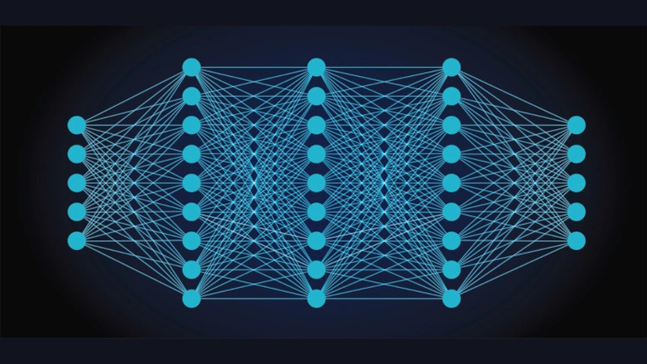

## A tutorial on Neural Networks

This is a series of tutorials on the basic types of neural networks,
like FNN, CNN, and RNN, also covering the required Linear Algebra, and Matrix Calculus
prerequisites to understand the internal workings of forward and backward passes.
<b>No PyTorch or TensorFlow is used</b> - code is built from first principles, as it is the only
way to gain a deep understanding of Deep Learning.

### _Under construction - Content will change significantly_

__Georgios Kyriakakis__
